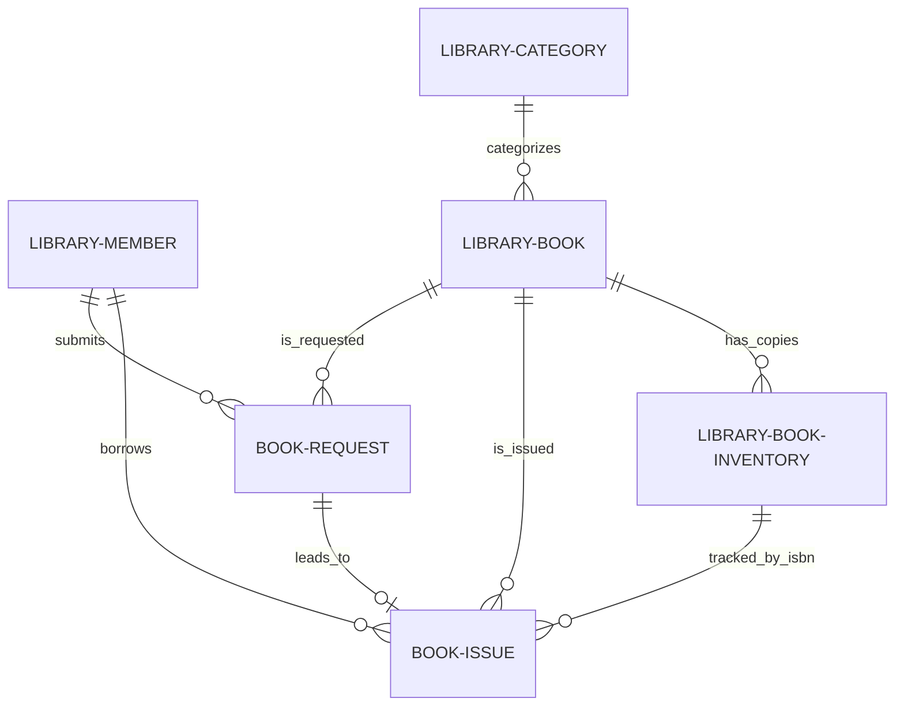

# ER Diagram

The following Mermaid diagram illustrates the relationships between the core library DocTypes in Maxedu.

## Key Entities
- **Library Member**: The central user profile for all library transactions.
- **Library Book**: The master record for each unique book title and metadata.
- **Library Book Inventory**: Individual physical copies tracked by ISBN and shelf location.
- **Book Request**: Manages the approval and reservation workflow.
- **Book Issue**: The primary transaction record for every borrowing instance.

This diagram helps visualize the data flow and integrity within the Maxedu library module.
